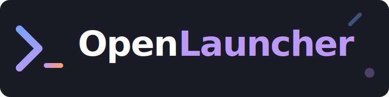

<div align="center">



<br/>

# ⌨️ OpenLauncher

**A blazing-fast, keyboard-first command palette for your desktop.**
Open anything — apps, URLs, system actions — semantically powered by AI.

<br/>

[](LICENSE)
[](https://electronjs.org)
[](https://typescriptlang.org)
[](#)
[](CONTRIBUTING.md)

<br/>

<!--
  Replace with an actual screenshot/GIF after first run:
  
-->

```
╭──────────────────────────────────────────────────────────╮
│  ⌘ Space                                                 │
│  ·· ················································ [esc]│
│ ┄┄┄┄┄┄┄┄┄┄┄┄┄┄┄┄┄┄┄┄┄┄┄┄┄┄┄┄┄┄┄┄┄┄┄┄┄┄┄┄┄┄┄┄┄┄┄┄┄┄┄┄┄┄ │
│  ⬡  Visual Studio Code          Applications            │
│  ⬡  Figma                                               │
│  ◎  GitHub                       Web                    │
│  ◎  Claude                                              │
│  ⚡  Sleep                        Actions               │
│  ⚡  Lock Screen                                        │
╰──────────────────────────────────────────────────────────╯
```

</div>

---

## Why Launcher?

Most app launchers are either too heavy, too opinionated, or locked to one platform.
**Launcher** is none of those things.

- **< 5MB** install footprint
- **Zero config** — works out of the box, discovers your apps automatically
- **Hackable** — ~500 lines of TypeScript, easy to fork and customize
- **Cross-platform** — one codebase for macOS, Windows, and Linux

---

## Features

| | |
|---|---|
| **⚡ Instant toggle** | `Cmd/Ctrl + Space` shows or hides the palette from anywhere |
| **🔍 Fuzzy search** | Finds apps even with typos — exact → prefix → substring → subsequence |
| **🌐 Web search** | Prefix with `?` or `search` to open Google instantly |
| **🖥️ App discovery** | Auto-scans Applications (macOS), Program Files (Windows), `.desktop` files (Linux) |
| **🌗 Light/Dark mode** | Follows your OS theme, or toggle manually — persisted across sessions |
| **🖱️ Drag to reposition** | Grab the grip handle to place it wherever you want on screen |
| **⌨️ Keyboard-first** | `↑↓` navigate, `↵` open, `Tab` cycle, `Esc` dismiss |
| **🪟 Frameless & transparent** | Glass-morphism design that sits natively on your desktop |

---

## Quick Start

### Prerequisites

- [Node.js](https://nodejs.org) 18+
- [npm](https://npmjs.com) 9+

### Install & Run

```bash
git clone https://github.com/your-username/launcher.git
cd launcher
npm install
npm run build
npm start
```

Press `Cmd+Space` (macOS) or `Ctrl+Space` (Windows/Linux) to open the palette.

### Development (watch mode)

```bash
npm run dev
```

Watches both `src/main/` and `src/renderer/` and recompiles on save.

---

## Usage

### Keyboard shortcuts

| Key | Action |
|-----|--------|
| `Cmd/Ctrl + Space` | Toggle launcher |
| `↑` / `↓` | Navigate results |
| `Tab` / `Shift+Tab` | Navigate results |
| `Enter` | Open selected item |
| `Esc` | Clear input / hide |

### Web search shortcut

Prefix any query with `?` or `search` to trigger a live Google search:

```
? what is the meaning of life
search best TypeScript patterns 2024
```

---

## Project Structure

```
launcher/
├── src/
│   ├── main/
│   │   ├── index.ts       # Main process: window, shortcuts, app discovery, IPC
│   │   └── preload.ts     # Context bridge — exposes safe APIs to renderer
│   └── renderer/
│       ├── index.html     # Shell HTML
│       ├── styles.css     # Design system (CSS variables, light/dark themes)
│       └── renderer.ts    # UI logic: search, keyboard nav, theme toggle
├── tsconfig.main.json     # CommonJS target for Electron main
├── tsconfig.renderer.json # ES2020 target for browser renderer
└── package.json
```

---

## Customization

### Add built-in items

Edit the `BUILT_IN` array in `src/main/index.ts`:

```ts
{
  id: "my-site",
  label: "My Site",
  subtitle: "mysite.com",
  category: "web",
  action: "url:https://mysite.com",
},
```

**Action types:**

| Prefix | Behavior |
|--------|----------|
| `url:<href>` | Opens in default browser |
| `open:<path>` | Opens file or app via OS |
| `exec:<cmd>` | Runs shell command detached |
| `action:sleep` | Puts computer to sleep |
| `action:lock` | Locks the screen |
| `action:trash` | Empties the trash |

### Theming

All colors live in CSS variables in `src/renderer/styles.css`. The `:root` block is dark, `.light` overrides for light mode:

```css
:root {
  --bg-panel: rgba(18, 18, 22, 0.93);
  --icon-app: #9d9df7;
  /* ... */
}

.light {
  --bg-panel: rgba(250, 250, 252, 0.94);
  --icon-app: #5b5bd6;
  /* ... */
}
```

### Change the global shortcut

In `src/main/index.ts`:

```ts
const shortcut = "Alt+Space"; // change to any Electron accelerator
globalShortcut.register(shortcut, toggleWindow);
```

---

## How it works

```
┌─────────────────────────────────────────────────────┐
│  Global shortcut (Ctrl/Cmd+Space)                   │
│         │                                           │
│         ▼                                           │
│  BrowserWindow.show() + send("launcher:show")       │
│         │                                           │
│         ▼                                           │
│  Renderer: clear input, focus, doSearch("")         │
│         │                                           │
│         ▼                                           │
│  ipcRenderer.invoke("launcher:search", query)       │
│         │                                           │
│         ▼                                           │
│  Main: fuzzyScore() × allItems → top 10             │
│         │                                           │
│         ▼                                           │
│  Renderer: renderResults() → grouped by category    │
│         │                                           │
│         ▼                                           │
│  Enter → ipcMain.execute(action) → shell / spawn    │
└─────────────────────────────────────────────────────┘
```

App discovery runs once at startup and merges with built-in items. On macOS it scans `/Applications` and `~/Applications`; on Windows it walks `Program Files`; on Linux it parses `.desktop` files from `/usr/share/applications`.

---

## Roadmap

- [ ] Plugin system for custom result providers
- [ ] Clipboard history integration
- [ ] Calculator / unit converter built-in
- [ ] File content search (ripgrep)
- [ ] Packaged distributable (`.dmg`, `.exe`, `.AppImage`)
- [ ] Result ranking based on launch frequency

Want to tackle one of these? **PRs are very welcome.**

---

## Contributing

1. Fork the repo
2. Create a branch: `git checkout -b feat/my-feature`
3. Commit your changes: `git commit -m 'feat: add my feature'`
4. Push and open a PR

Please follow [Conventional Commits](https://www.conventionalcommits.org/) for commit messages.

---

## License

MIT © [your-username](https://github.com/your-username)

---

<div align="center">

If this saved you time, a ⭐ goes a long way.

</div>
